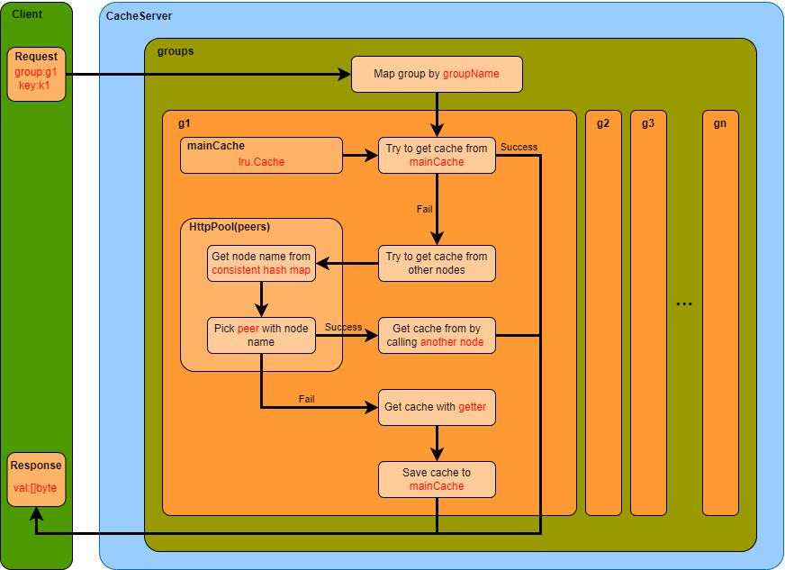

# Study of go-cache based on geektutu
基于golang的分布式缓存
[7days-golang](https://geektutu.com/post/geecache-day1.html)
[golang-api](https://studygolang.com/pkgdoc)

## 介绍
模仿groupcache的基于内存的分布式缓存中间件
- 实现了基于**LRU策略**的缓存淘汰
- 采用`sync.Mutex`实现了单机并发缓存
- 基于`net/http`实现了基于http协议的缓存查询
- 采用**一致性哈希**原理实现了缓存的分片存储，为分布式缓存提供了基础
- 实现了多节点的分布式缓存，采用**singleflight**，实现了请求的合并发送，避免缓存击穿
- 采用**protobuf**实现了数据的高性能序列化和反序列化

---

## 整体架构
### 1. Group
- Group是一个**缓存单元**，能够独立实现缓存的写入和读取，一个包含多个group的缓存应用在读取时通过指定**name**来区分不同的group；
- Group中包含：name,getter,mainCache,peers,loader几个部分：
  - name: 用于区分不同的group，可以看作groupID；
  - getter: 数据获取器，用于在多节点缓存中不存在当前缓存的情况下通过其他方式获取数据，由用户传入来指定，非空；
  - [mainCache](#2-maincache): 属于cache类，**实现了缓存的添加和读取方法**，底层为LRU结构，通过传入参数指定内存淘汰阈值；
  - [peers](#3-httppoolgrouppeers): 多节点缓存获取器(分布式缓存的实现者)，能够访问其他任意节点以获取缓存。当本节点中不存在当前缓存时，使用peers尝试从远程节点获取数据，获取失败则尝试通过getter获取数据；
  - loader：基于singleflight原理实现的并发请求合并器，主要用于分布式缓存获取过程中的并发请求合并。
- Group.Get: 该方法用来获取对应key的缓存值，首先查看主缓存中是否存在对应值，若不存在，则调用`load`方法获取对应值；
- Group.load: 该方法中首先尝试通过`group.peers`访问分布式节点获取对应值，若仍失败，则调用当前节点的`getLocally`方法获取对应值，并保存在mainCache当中。

### 2. mainCache
- mainCache中持有**同步器**和**lru对象**，实现了`add`和`get`方法进行缓存的添加和删除；
- lru：缓存主体，采用**最近最少使用策略**进行缓存淘汰，由map结构和双向链表(`container/list.List`)实现。

### 3. HttpPool(Group.peers)
- HttpPool用于从其他节点中获取缓存，实现了`PeerPicker`接口的`PickPeer`方法，用来获取**分布式节点调用器(HttpGetter)**；
- HttpPool中持有**一致性哈希结构**，用来实现`key->node`的映射；
- HttpPool中保存所有分布式节点的调用器，在采用一致性哈希结构找出当前key对应的节点名后，就可以从中获取对应节点的调用器进行调用；
- HttpPool实现了`ServeHTTP`方法，在其他节点调用当前节点时使用提供服务；
- HttpPool.Get: 该方法用于从远程节点获取缓存数据。

### 4. ByteView
- ByteView是缓存存储和获取过程中传递的**统一的数据结构**，其对作为缓存值的byte数组进行了封装，保证了缓存数据的只读性。

### 5. singleflight
- singleflight是参考了go语言的singleflight实现的一个请求合并工具；
- singleflight中使用**map**和**同步器**实现了并发请求的合并；
- 原理：
  - 当有多个**重复请求**并发时，第一个请求key将会标记在map中，表明当前请求正在处理，此请求会被正常发送并等待返回值，接收到返回值后，map中的标记会被删除；
  - 之后的相同请求到达时，若map中已标记了此请求，则此请求就**不会被正常处理**，而是**阻塞地等待**第一个请求值的返回；
  - 阻塞等待由全局的同步器来实现。
- 采用singleflight之后，若某请求的RTT为1s，则**不论1s内发生多少此该请求，该请求只会被执行一次**，这就是并发请求的合并。

---

## 工作流程

---

## 关键点
- 数据的键值对存储
- 内存不足时的淘汰策略
- 并发保护
- 一致性哈希
- 集群扩展
- 请求合并