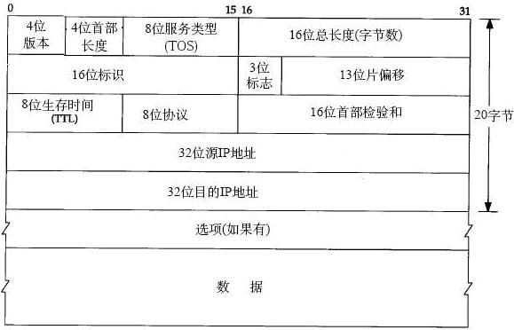
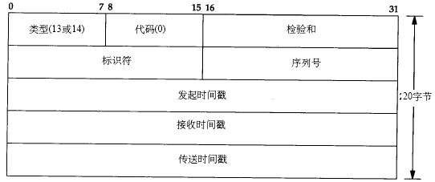

# 使用go实现ping操作

## icmp协议
- tcp/ip的子协议
- 不同的操作有指定操作类型码和操作码
- ip报文结构：
    - 
- icmp报文结构：
    - 
    - icmp报文在ip数据报内
    - 前20字节为ip首部，之后是icmp报文
    - icmp首部：
        - type: 8bit
        - code: 8bit
        - checksum: 16bit
        - id: 16bit
        - seq: 16bit
    - icmp内容
- icmp校验和算法
    - 相邻两个字节拼接组成16bit的数，将这些数累加求和
    - 若长度为奇数，则剩余的1个字节也需要累加
    - 结果的高16位和低16位不断求和，直到高16位为0
    - 得出结果后，取反，即为校验和的结果

## ping操作
- icmp请求：type = 8, code = 0, desc = Echo request
- 参数：
    - `-w` timeout
    - `-n` count
    - `-l` size 发送缓冲区的大小