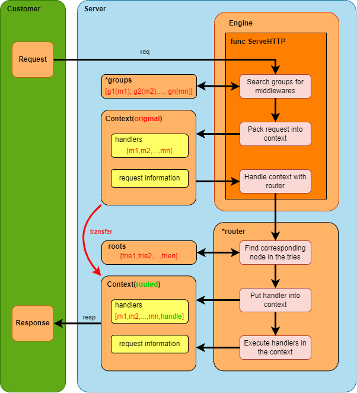

# Study of go-web based on geektutu
[7days-golang](https://geektutu.com/post/gee-day1.html)\
[golang-api](https://studygolang.com/pkgdoc)

## 介绍
提供完整的web服务，包括：
- 基于前缀树的请求路由(可以实现路径参数获取和路径的通配)
- 分组控制和组级别的中间件
- 静态文件服务
- HTML模板渲染

---

## 整体架构

### 1. Engine
   - golang的net/http中定义了HandlerFunc结构体，需要**实现ServeHttp方法**以作为HTTP处理器使用，因此Engine需要实现此方法
   - Engine继承了**RouteGroup**，属于一种特殊的group，所有路由都属于此group;
   - Engine实现了**ServeHTTP方法**，在该方法中可以对请求进行进一步的处理;
   - ServeHTTP:
     - Engine持有[group列表](#3-groups)，其中保存了所有分组的信息，方便在请求到达之后，在所有group中获取此请求所需使用的中间件;
     - 将所有**请求信息**和**中间件处理器**打包成为一个[Context](#2-context);
     - Engine中持有[全局路由器](#4-router)，所有的请求首先都需要engine进行初步处理之后，使用路由器进行进一步处理。
### 2. Context
   - Context中存储**请求信息**和**处理器列表**(包括中间件和路由处理器);
   - 在router找到Context对应的路由处理器后，会将该处理器放入Context的处理器列表中，并通过`Context.Next()`方法按顺序调用处理器;
   - Context实现了多个方法，可以实现不同类型数据的快速写入。
### 3. *groups
   - *groups为**分组列表**，由Engine持有，用于保存所有分组;
   - 在处理请求时，会从*groups中获取当前请求对应的分组的所有中间件，并保存在对应的Context中，便于对请求进行分别处理;
   - Engine也属于一个group，在服务器初始化时，就被创建并放在*groups中，Engine中可以定义针对全局的中间件。
### 4. \*router
   - \*router为**全局路由器**，由Engine持有，Engine在预处理之后会调用`*router.handler()`方法进一步处理请求，负责：**路由查找**、**处理器查找**以及**开始Context的处理流程**的任务;
   - \*router的路由查找功能是通过**路径前缀树**实现的：
     - \*router中持有多个**针对不同请求方法的前缀树**，如: "GET前缀树"、"POST前缀树"等;
     - \*router可以通过前缀树找到当前Context对应的节点，并从节点中获取**此路径对应的handler的key**，之后就可以通过此key找到对应的handler。
   - `*router.handler()`方法中，在完成节点查找和处理器添加之后，调用`*context.Next()`方法，使Context开始处理流程。

---

## 工作流程

---

## 附加功能
- 静态文件服务器
- HTML模板解析